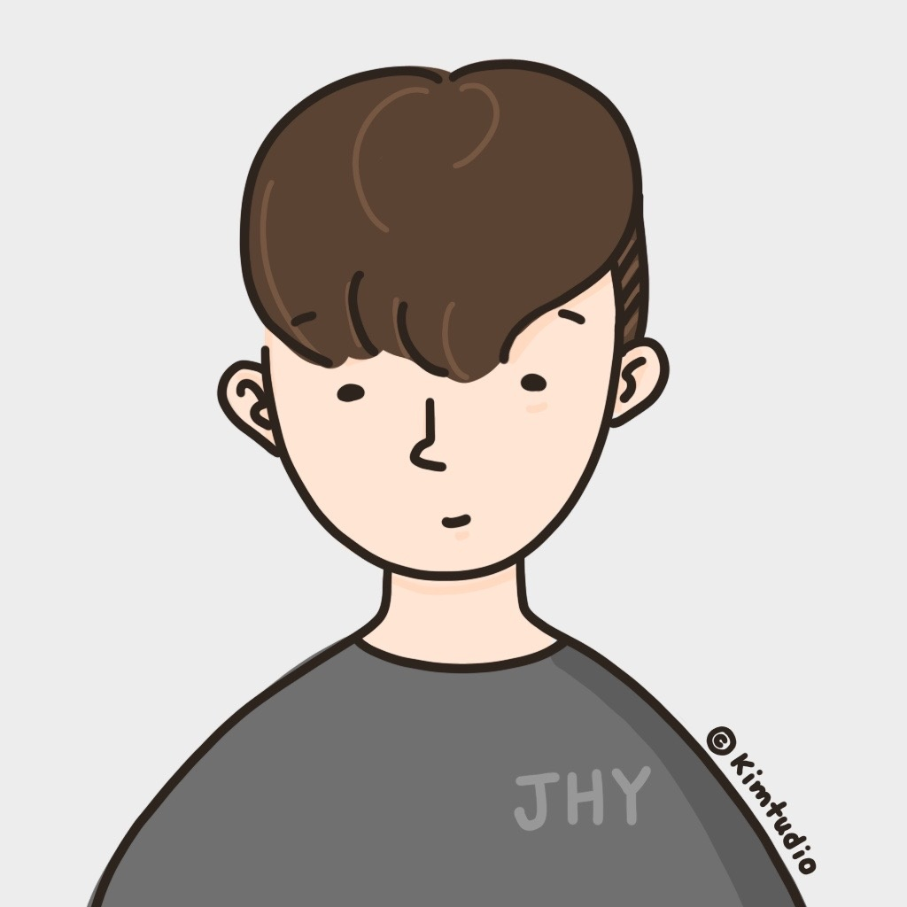

# Hireview - 2023 AI Hackathon 1st Place 
[Competition Outline](https://udemy.wjtb.co.kr/event/id/179)

## ⚡ Main Concept
**Chat-based Personalized AI Interview Service**

## 👋 URLS
- [Landing Page](https://hireview.softr.app/products)
- [Product](https://hireview.softr.app/products)
- [Demo Video](https://youtu.be/bWd4dNC2ly8)
- [Speech Video](https://youtu.be/g-hA8vYcROk?t=1193)
- [News1](https://blog.naver.com/wantedlab/223196662023)
- [News2](https://zdnet.co.kr/view/?no=20230821084538)

## 🎨 Roles & Responsibilities
|Common|hotorch|yumyeom|jsh2581|statbsh|UgwayK|
|:---:|:---:|:---:|:---:|:---:|:---:|
|||||||
||   |||||
|Prompt Engineering   Python Development |**AI PM**  Langchain   Landing Pages|MLOps   LangChain |MLOps   AWS Deployment   | Streamlit   FE   UI/UX (Figma/Planning) |Streamlit   FE   UI/UX (Figma/Planning) |

